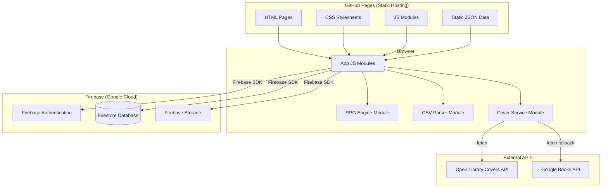

# Design Document: Fantasy Reading Tracker

## Overview

The Fantasy Reading Tracker is a serverless, client-side web application that gamifies personal reading through a sword-and-sorcery RPG theme. Users manage a personal book library, import reading history from Goodreads, and progress through an adventure narrative by earning XP, leveling up a Barbarian avatar, completing story-driven Quests, and connecting with a community of fellow readers. The app is hosted as static files on GitHub Pages and communicates directly with Firebase services from the browser — there is no backend server.

### Design Goals

- **Engaging progression loop**: Every reading action (adding a book, completing a book, hitting a milestone) feeds back into the RPG system with immediate, visible feedback.
- **Low friction data entry**: Automatic cover retrieval and Goodreads CSV import (handled entirely in the browser) minimize manual effort.
- **Responsive-first**: The UI must work equally well on a 320px mobile screen and a 2560px desktop monitor.
- **Correctness of the XP/Level engine**: The leveling math must be deterministic and recalculate correctly on any mutation (add, delete, import).
- **Zero infrastructure cost**: The entire stack runs on free tiers — GitHub Pages for hosting, Firebase Spark plan for auth/database/storage.

### Technology Stack

| Layer | Choice | Rationale |
|---|---|---|
| Hosting | GitHub Pages | Free static file hosting; no server to maintain; deploys directly from the repo |
| Frontend | Vanilla HTML + CSS + JavaScript (ES modules) | No build tools, no npm required; files are served directly as static assets |
| Styling | Custom CSS with fantasy theme variables | Plain CSS custom properties enforce visual consistency without a framework |
| Database | Firebase Firestore (Spark free tier) | NoSQL cloud database; 1 GB storage, 50k reads/day, 20k writes/day; browser SDK available |
| Authentication | Firebase Authentication (free tier) | Handles registration, login, logout, password reset; email/password provider |
| File storage | Firebase Storage (free tier) | Custom cover image uploads; 5 GB storage, 1 GB/day download |
| Cover service | Open Library Covers API (primary) + Google Books API (fallback) | Free tier; no API key required for Open Library; broad catalog coverage |
| RPG Engine | Client-side JS modules | Pure functions for XP calculation, level derivation, quest evaluation — no server needed |
| CSV import | Browser FileReader API + client-side CSV parsing | Goodreads CSV parsed entirely in the browser; no file upload to a server |
| Static data | JSON files in the repo | Quests, rewards, achievements, NPC characters stored as JSON; loaded at startup |
| Testing | Jest + fast-check (PBT) | Jest for unit tests; fast-check for property-based tests on pure JS logic |

---

## Architecture

The application is entirely client-side. Static HTML, CSS, and JavaScript files are served from GitHub Pages. The browser communicates directly with Firebase services using the Firebase JavaScript SDK (loaded via CDN). There is no backend server.



### Key Architectural Decisions

**No backend server**: The browser talks directly to Firebase using the Firebase JavaScript SDK. Firebase Security Rules enforce authentication and authorization at the database level, replacing what a server-side API would normally handle.

**RPG Engine as a pure client-side module**: All XP calculation, level derivation, quest progress evaluation, and achievement checking are encapsulated in a single `rpgEngine.js` module. This module contains only pure functions (no I/O), making it straightforward to property-test and reason about. Firestore reads/writes are handled by the calling app module.

**Optimistic UI updates**: The app applies XP/Level changes in memory immediately after book mutations, then writes to Firestore asynchronously. This keeps the UI feeling snappy without waiting for a round-trip.

**Cover retrieval as a client-side fallback chain**: The browser fetches covers directly from Open Library (no API key required). On failure or empty result, it falls back to Google Books API, then to a themed placeholder. Both APIs support CORS for browser requests.

**Goodreads import entirely in the browser**: The user selects a CSV file; the browser reads it with the FileReader API and parses it with a client-side CSV parser module. No file is uploaded to any server. Import job status is written to Firestore for display purposes.

**Static data as JSON files**: Quests, rewards, achievements, and NPC characters are defined in JSON files committed to the repo. They are loaded once at app startup and held in memory. This avoids unnecessary Firestore reads for data that never changes at runtime.

---

## Components and Interfaces

### File Structure

```
/                              # GitHub Pages root
├── index.html                 # Entry point / login page
├── dashboard.html
├── library.html
├── profile.html
├── friends.html
├── settings.html
├── css/
│   ├── main.css               # Global styles and CSS custom properties (theme tokens)
│   ├── components.css         # Reusable component styles
│   └── fantasy-theme.css      # Fantasy-specific decorative styles
├── js/
│   ├── app.js                 # App bootstrap, Firebase init, routing
│   ├── auth.js                # Firebase Auth wrappers (register, login, logout, reset)
│   ├── library.js             # Firestore CRUD for book records
│   ├── import.js              # FileReader + CSV parsing + Firestore write
│   ├── rpgEngine.js           # Pure XP/Level/Quest/Achievement calculation functions
│   ├── coverService.js        # Open Library → Google Books → placeholder fallback
│   ├── social.js              # Friend requests, friendships, profile visibility
│   ├── stats.js               # Reading statistics computation
│   ├── goals.js               # Reading goal CRUD and progress calculation
│   ├── npc.js                 # NPC dialogue selection and display
│   ├── barbarian.js           # Barbarian avatar rendering and customization
│   ├── csvParser.js           # Goodreads CSV parsing logic (pure functions)
│   └── ui.js                  # DOM helpers, modal management, toast notifications
└── data/
    ├── quests.json            # Quest definitions (id, title, narrative, category, completionValue, rewardId, bonusXp)
    ├── rewards.json           # Reward definitions (id, name, description, type, metadata)
    ├── achievements.json      # Achievement definitions (id, name, description, hintText, iconUrl)
    └── npcs.json              # NPC characters and dialogue lines
```

### Module Interfaces

#### `auth.js` — Firebase Authentication Wrappers

```javascript
// Register a new user with email and password.
// Returns the Firebase User object on success.
// Throws FirebaseError on duplicate email or weak password.
async function register(email, password, username, displayName)

// Sign in an existing user.
// Returns the Firebase User object on success.
// Throws FirebaseError on invalid credentials.
async function login(email, password)

// Sign out the current user and redirect to index.html.
async function logout()

// Send a password reset email to the given address.
async function sendPasswordReset(email)

// Returns the currently authenticated Firebase User, or null.
function getCurrentUser()
```

#### `library.js` — Firestore Book Record Operations

```javascript
// Add a new book record to users/{userId}/books/{bookId}.
// Returns the new document ID.
async function addBook(userId, bookData)

// Update an existing book record (shelf, rating, review, genres, coverUrl).
async function updateBook(userId, bookId, updates)

// Delete a book record and trigger XP recalculation.
async function deleteBook(userId, bookId)

// Fetch all book records for a user.
// Returns an array of book objects.
async function getBooks(userId)

// Fetch a single book record.
async function getBook(userId, bookId)
```

#### `rpgEngine.js` — Pure RPG Calculation Functions

```javascript
/**
 * Calculate XP awarded for a single book.
 * Uses page count if available; defaults to 100 XP.
 * Applies any active XP multiplier rewards.
 *
 * @param {object} book - { pageCount: number|null }
 * @param {object[]} activeRewards - [{ type, multiplier, expiresAt }]
 * @param {Date} now
 * @returns {number}
 */
function calculateBookXp(book, activeRewards, now)

/**
 * Calculate total XP from a collection of read books.
 *
 * @param {object[]} books - array of book records
 * @param {object[]} activeRewards
 * @param {Date} now
 * @returns {number}
 */
function calculateTotalXp(books, activeRewards, now)

/**
 * Derive the current Level from total XP using the XP table.
 * Returns the largest level n such that xpTable[n-1] <= totalXp.
 *
 * @param {number} totalXp
 * @param {number[]} xpTable - array of cumulative XP thresholds (index = level - 1)
 * @returns {number}
 */
function deriveLevel(totalXp, xpTable)

/**
 * Calculate XP required to reach the next level.
 *
 * @param {number} totalXp
 * @param {number[]} xpTable
 * @returns {number}
 */
function xpToNextLevel(totalXp, xpTable)

/**
 * Evaluate quest completion conditions against current library stats.
 * Returns the array of quest IDs whose completion condition is now met.
 *
 * @param {object[]} quests - quest definitions from quests.json
 * @param {object} libraryStats - { booksRead, genresExplored, readingStreak, friendCount }
 * @returns {string[]}
 */
function evaluateQuestCompletion(quests, libraryStats)

/**
 * Calculate progress (0.0–1.0) for a single quest.
 *
 * @param {object} quest
 * @param {object} libraryStats
 * @returns {number}
 */
function questProgress(quest, libraryStats)
```

#### `csvParser.js` — Goodreads CSV Parsing (Pure Functions)

```javascript
/**
 * Parse a Goodreads CSV string into structured row objects.
 * Skips malformed rows and records errors.
 *
 * @param {string} csvContent
 * @returns {{ rows: object[], skippedCount: number, errors: string[] }}
 */
function parseGoodreadsCSV(csvContent)

/**
 * Map a Goodreads exclusive_shelf value to an App shelf name.
 *
 * @param {string} goodreadsShelf - "read" | "to-read" | "currently-reading"
 * @returns {"read" | "currently_reading" | "want_to_read" | null}
 */
function mapShelf(goodreadsShelf)
```

#### `coverService.js` — Cover Image Retrieval

```javascript
/**
 * Fetch a cover image URL for a book.
 * Tries Open Library first, then Google Books, then returns the placeholder URL.
 *
 * @param {string} title
 * @param {string} author
 * @param {string|null} isbn
 * @returns {Promise<string>} - resolved cover URL (never rejects)
 */
async function fetchCoverUrl(title, author, isbn)
```

#### `stats.js` — Reading Statistics Computation

```javascript
/**
 * Compute all required statistics from a user's book records.
 * All fields are always defined (never null) even for empty libraries.
 *
 * @param {object[]} books
 * @param {object} filter - { year?: number, genre?: string, author?: string }
 * @returns {object} stats
 */
function computeStats(books, filter)
```

---

## Data Models

### Firestore Collections

All user data is stored in Firestore. Static data (quests, rewards, achievements, NPCs) lives in JSON files in the repo.

#### `users/{userId}`

```javascript
{
  email: string,
  username: string,                  // unique display handle
  displayName: string,
  profileVisibility: "public" | "friends_only",
  createdAt: Timestamp,
  updatedAt: Timestamp,

  // Barbarian customization
  barbarian: {
    hairStyle: string,
    hairColor: string,
    skinTone: string,
    armorStyle: string,
    weaponType: string,
    unlockedCosmetics: string[]      // IDs of cosmetic rewards earned
  },

  // RPG profile (denormalized for fast dashboard reads)
  rpg: {
    totalXp: number,
    currentLevel: number,
    updatedAt: Timestamp
  }
}
```

#### `users/{userId}/books/{bookId}`

```javascript
{
  title: string,
  author: string,
  isbn: string | null,
  pageCount: number | null,
  shelf: "read" | "currently_reading" | "want_to_read",
  genres: string[],
  coverUrl: string | null,           // from Open Library or Google Books
  customCoverUrl: string | null,     // Firebase Storage URL if user uploaded
  rating: number | null,             // 1–5
  review: string | null,
  completedAt: Timestamp | null,     // set when moved to "read"
  createdAt: Timestamp,
  updatedAt: Timestamp
}
```

#### `users/{userId}/questProgress/{questId}`

```javascript
{
  questId: string,                   // references quests.json
  currentValue: number,
  completedAt: Timestamp | null
}
```

#### `users/{userId}/earnedRewards/{rewardId}`

```javascript
{
  rewardId: string,                  // references rewards.json
  earnedAt: Timestamp,
  expiresAt: Timestamp | null,       // for time-limited XP multipliers
  activated: boolean
}
```

#### `users/{userId}/earnedAchievements/{achievementId}`

```javascript
{
  achievementId: string,             // references achievements.json
  earnedAt: Timestamp
}
```

#### `users/{userId}/readingGoals/{goalId}`

```javascript
{
  targetBooks: number,
  startDate: Timestamp,
  endDate: Timestamp,
  createdAt: Timestamp,
  updatedAt: Timestamp
}
```

#### `friendRequests/{requestId}`

```javascript
{
  senderId: string,                  // Firebase Auth UID
  recipientId: string,
  status: "pending" | "accepted" | "rejected",
  createdAt: Timestamp
}
```

#### `friendships/{friendshipId}`

```javascript
{
  userId: string,
  friendId: string,
  createdAt: Timestamp
}
```

#### `importJobs/{jobId}`

```javascript
{
  userId: string,
  status: "processing" | "complete" | "failed",
  importedCount: number,
  skippedCount: number,
  errorMessage: string | null,
  createdAt: Timestamp,
  updatedAt: Timestamp
}
```

### Static JSON Data Files

#### `data/quests.json` (example entry)

```json
[
  {
    "id": "quest_10_books",
    "title": "The First Saga",
    "narrativeDesc": "Ten tomes have been consumed by the flame of your curiosity...",
    "category": "books_read",
    "completionValue": 10,
    "rewardId": "reward_iron_helm",
    "bonusXp": 500
  }
]
```

#### `data/rewards.json` (example entry)

```json
[
  {
    "id": "reward_iron_helm",
    "name": "Iron Helm of the Wanderer",
    "description": "A battered helm worn by a thousand-mile traveler.",
    "type": "cosmetic",
    "metadata": { "cosmeticSlot": "armorStyle", "value": "iron_helm" }
  }
]
```

#### `data/achievements.json` (example entry)

```json
[
  {
    "id": "ach_first_book",
    "name": "The First Rune",
    "description": "You have logged your first book.",
    "hintText": "Log your first book to unlock.",
    "iconUrl": "img/achievements/first_rune.svg"
  }
]
```

#### `data/npcs.json` (example entry)

```json
[
  {
    "id": "npc_grimwald",
    "name": "Grimwald the Archivist",
    "personality": "Gruff but wise",
    "portraitUrl": "img/npcs/grimwald.png",
    "dialogues": [
      { "trigger": "account_creation", "text": "Another seeker of knowledge arrives..." },
      { "trigger": "level_up", "text": "Your power grows, warrior. The scrolls do not lie." }
    ]
  }
]
```

### XP Progression Table

The level thresholds follow a quadratic curve to keep early levels fast and later levels more challenging:

| Level | Cumulative XP Required |
|---|---|
| 1 | 0 |
| 2 | 200 |
| 3 | 500 |
| 4 | 900 |
| 5 | 1,400 |
| 10 | 5,400 |
| 20 | 19,400 |
| 50 | 122,400 |

Formula: `threshold(n) = 100 * n * (n - 1)` for n ≥ 1.

### XP Award Rules

| Event | XP Awarded |
|---|---|
| Book marked "Read" (no page count) | 100 XP |
| Book marked "Read" (with page count) | `floor(pageCount / 3)` XP, minimum 50 XP |
| Quest completed | Quest's `bonusXp` value |
| Active XP multiplier reward | Base XP × multiplier |

### Firebase Security Rules

Firestore Security Rules enforce that users can only read and write their own data, and that social data (friend requests, friendships) is accessible only to the involved parties. Profile documents are readable by all authenticated users when visibility is "public", and only by confirmed friends when visibility is "friends_only". These rules replace server-side authorization middleware.


---

## Correctness Properties

*A property is a characteristic or behavior that should hold true across all valid executions of a system — essentially, a formal statement about what the system should do. Properties serve as the bridge between human-readable specifications and machine-verifiable correctness guarantees.*

The RPG Engine, CSV parser, XP/Level calculations, quest progress logic, and access control rules are all pure JavaScript functions that are well-suited to property-based testing. UI rendering, external service integration (Firebase, cover APIs), and configuration checks are handled by example-based and integration tests instead.

The property-based testing library used is **fast-check** (JavaScript), run with **Jest**.

---

### Property 1: Registration validation

*For any* (email, password) pair, the client-side registration function succeeds if and only if the email is not already registered and the password is at least 8 characters long; all other inputs are rejected without creating a Firebase Auth account or a Firestore user document.

**Validates: Requirements 1.1, 1.3**

---

### Property 2: Password reset token expiry

*For any* password reset token and any point in time, the token is valid before its expiry timestamp and invalid at or after its expiry timestamp. Firebase Authentication enforces this server-side; the client-side `sendPasswordReset` function always delegates to Firebase and never issues tokens directly.

**Validates: Requirements 1.7**

---

### Property 3: Book record data completeness

*For any* valid book input (title, author, shelf, one or more genres), the Firestore document written to `users/{userId}/books/{bookId}` SHALL contain all of those fields with values equal to the input values.

**Validates: Requirements 2.2**

---

### Property 4: XP award formula correctness

*For any* book marked as "Read", the XP awarded SHALL equal `floor(pageCount / 3)` (minimum 50) when a page count is available, or 100 XP when no page count is available. When an active XP multiplier reward exists and has not expired, the base XP SHALL be multiplied by the reward's multiplier before being awarded.

**Validates: Requirements 2.3, 6.1, 8.4**

---

### Property 5: No XP for non-Read shelf moves

*For any* BookRecord moved to the "Currently Reading" or "Want to Read" shelf, the User's total XP SHALL remain unchanged.

**Validates: Requirements 2.4**

---

### Property 6: XP and Level consistency after any mutation

*For any* sequence of book additions, deletions, and imports, the user's `rpg.totalXp` stored in Firestore SHALL equal the sum of XP for all books currently on the "Read" shelf (plus any quest bonus XP), and `rpg.currentLevel` SHALL equal `deriveLevel(totalXp, xpTable)`. The `rpgEngine.js` module's pure recalculation functions are the single source of truth; Firestore stores the result.

**Validates: Requirements 2.7, 4.6, 6.6**

---

### Property 7: Cover service fallback

*For any* error response or empty result from the Cover_Service (including network errors, 404s, and malformed responses from Open Library or Google Books), the client-side `coverService.js` module SHALL return the themed placeholder cover URL rather than propagating an error or leaving the image broken.

**Validates: Requirements 3.3**

---

### Property 8: Goodreads CSV shelf mapping

*For any* valid Goodreads CSV file, every parsed row with `exclusive_shelf = "read"` SHALL map to the App's "Read" shelf, every row with `exclusive_shelf = "to-read"` SHALL map to "Want to Read", and every row with `exclusive_shelf = "currently-reading"` SHALL map to "Currently Reading".

**Validates: Requirements 4.2**

---

### Property 9: Import count accuracy

*For any* Goodreads CSV file, `importedCount + skippedCount` SHALL equal the total number of data rows in the file (excluding the header row).

**Validates: Requirements 4.3**

---

### Property 10: Import deduplication

*For any* Goodreads CSV file containing rows that match books already in the User's Library (by title + author), those rows SHALL be skipped and counted in `skippedCount`, and no duplicate BookRecords SHALL be created.

**Validates: Requirements 4.4**

---

### Property 11: Invalid CSV leaves library unchanged

*For any* file that is not a valid Goodreads CSV (wrong columns, binary content, empty file, etc.), `parseGoodreadsCSV` SHALL return an error result and the calling `import.js` module SHALL not write any documents to Firestore, leaving the user's `users/{userId}/books` subcollection exactly as it was before the upload attempt.

**Validates: Requirements 4.5**

---

### Property 12: Goodreads import round-trip

*For any* valid Goodreads CSV file, parsing the file to produce BookRecords, then serializing those BookRecords back to CSV format, then parsing the resulting CSV again SHALL produce a set of BookRecords equivalent to the first parse (same titles, authors, shelves, and ratings).

**Validates: Requirements 4.7**

---

### Property 13: Customization persistence round-trip

*For any* valid Barbarian customization selection (any combination of hair style, hair color, skin tone, armor style, weapon type, and unlocked cosmetics), writing the selection to `users/{userId}.barbarian` in Firestore and then reading it back SHALL return a selection equal to the saved input.

**Validates: Requirements 5.3**

---

### Property 14: Cosmetic reward unlocks customization option

*For any* cosmetic reward whose ID appears in `users/{userId}.barbarian.unlockedCosmetics`, that reward's cosmetic item SHALL appear as an available option in the character customization screen. Cosmetic items from rewards whose IDs are not in `unlockedCosmetics` SHALL NOT appear.

**Validates: Requirements 5.5**

---

### Property 15: Level derivation consistency

*For any* total XP value, `deriveLevel(xp, xpTable)` SHALL return the largest level `n` such that `xpTable.levelThresholds[n-1] <= xp`. Furthermore, if adding any positive amount of XP causes the total to cross a level threshold, `deriveLevel` SHALL return a strictly higher level than before.

**Validates: Requirements 6.2, 6.3**

---

### Property 16: Quest completion triggers reward

*For any* Quest (from `quests.json`) and any library state where the Quest's completion condition is met, `evaluateQuestCompletion` in `rpgEngine.js` SHALL include that Quest's ID in its result, and the associated Reward SHALL be written to `users/{userId}/earnedRewards/{rewardId}` exactly once.

**Validates: Requirements 7.3, 8.1**

---

### Property 17: Quest progress invariant

*For any* Quest and any library state, `questProgress(quest, libraryStats)` SHALL return a value in the range [0.0, 1.0], where 0.0 means no progress and 1.0 means the completion condition is fully met.

**Validates: Requirements 7.4**

---

### Property 18: NPC interaction completeness

*For any* NPC trigger event (account creation, level-up, quest completion, daily login), the NPC dialogue selected by `npc.js` from `npcs.json` SHALL include a non-empty NPC name, a non-empty portrait URL, and a non-empty dialogue line appropriate to the trigger context.

**Validates: Requirements 10.1, 10.2**

---

### Property 19: Reading goal progress calculation

*For any* active Reading_Goal with a target of `T` books and a current count of `C` books read within the goal period, the displayed progress SHALL equal `min(C / T, 1.0)`.

**Validates: Requirements 11.2, 11.5**

---

### Property 20: Stats completeness

*For any* user library state (including empty libraries), all required statistics (total books read, books read this year, average books per month, total pages read, favorite genres, current reading streak, top 10 authors) SHALL be computable by `computeStats` in `stats.js` and return a defined, non-null value.

**Validates: Requirements 12.1**

---

### Property 21: Stats filtering correctness

*For any* library state and any filter (year, genre, or author), all statistics returned by the filtered view SHALL be computed using only BookRecords that match the filter criteria, and no BookRecords outside the filter SHALL contribute to the filtered statistics.

**Validates: Requirements 12.4**

---

### Property 22: User search correctness

*For any* search query string and any set of user documents in Firestore, every User returned by the client-side search function SHALL have a username or display name that contains the query string (case-insensitive), and no User whose username and display name both do not contain the query string SHALL be returned.

**Validates: Requirements 13.1**

---

### Property 23: Bidirectional friendship

*For any* pair of Users where User A sends a friend request and User B accepts it, a `friendships` document SHALL exist with `userId = A, friendId = B` AND a separate `friendships` document SHALL exist with `userId = B, friendId = A`, ensuring both users see each other in their friends list.

**Validates: Requirements 13.2**

---

### Property 24: Friends list data completeness

*For any* User's friends list, every entry SHALL include the friend's Barbarian avatar data, current Level, and the title of their most recently completed book (or a defined "no books yet" placeholder if they have no read books).

**Validates: Requirements 13.5**

---

### Property 25: Profile data completeness

*For any* User with a public profile, the profile page SHALL include the User's Barbarian avatar, current Level, total XP, all earned Achievement badges, progress on all active Quests, and all books on the "Read" shelf.

**Validates: Requirements 14.1**

---

### Property 26: Profile access control

*For any* User whose `profileVisibility` field in Firestore is set to `"friends_only"`, any attempt by a non-friend to read that user's profile data SHALL be denied by Firestore Security Rules, regardless of the requesting user's identity. The client-side `social.js` module SHALL display a themed "access denied" message when a Firestore permission-denied error is received.

**Validates: Requirements 14.4**

---

### Property 27: Achievement idempotency

*For any* predefined milestone, the associated Achievement SHALL be written to `users/{userId}/earnedAchievements/{achievementId}` exactly once — the first time the milestone is reached — and SHALL NOT be written again if the same milestone condition is triggered subsequently. The client-side achievement check function SHALL be idempotent: calling it multiple times with the same library state SHALL produce the same set of newly-earned achievement IDs.

**Validates: Requirements 9.1**

---

## Error Handling

### Authentication Errors

| Scenario | Handling |
|---|---|
| Duplicate email on registration | Firebase Auth throws `auth/email-already-in-use`; `auth.js` catches and displays a descriptive message |
| Invalid login credentials | Firebase Auth throws `auth/wrong-password` or `auth/user-not-found`; `auth.js` displays a descriptive message without revealing which field is wrong |
| Expired or invalid session | Firebase Auth SDK automatically refreshes tokens; on unrecoverable expiry, the SDK fires an `onAuthStateChanged` event with `null`, and `app.js` redirects to the login page |
| Expired password reset link | Firebase Auth handles expiry server-side; the reset page displays a descriptive message and offers to resend |

### Library Errors

| Scenario | Handling |
|---|---|
| Missing required fields (title, author, shelf) | Client-side form validation prevents submission; field-level error messages are shown inline |
| Invalid rating value (outside 1–5) | Client-side validation rejects the value before writing to Firestore |
| Book not found (deleted or wrong user) | Firestore returns a permission-denied or not-found error; `library.js` catches and shows a themed error message |
| Cover upload exceeds size limit (5 MB) | Client-side size check before calling Firebase Storage; user sees a descriptive error message |

### Cover Retrieval Errors

The `coverService.js` module implements a client-side fallback chain:
1. Fetch from Open Library Covers API (`https://covers.openlibrary.org/b/isbn/{isbn}-L.jpg`)
2. On failure or empty result, fetch from Google Books API (`https://www.googleapis.com/books/v1/volumes?q=...`)
3. On failure or empty result, return the themed placeholder cover URL
4. The function never rejects — it always resolves with a URL. Errors are caught internally and logged to the browser console.

### Goodreads Import Errors

| Scenario | Handling |
|---|---|
| File is not a valid Goodreads CSV | `csvParser.js` returns an error result; `import.js` shows a descriptive message and does not write to Firestore |
| File exceeds size limit (10 MB) | Client-side size check before reading with FileReader; user sees a descriptive error message |
| Row missing required fields | Row is skipped; counted in `skippedCount`; error message recorded |
| Duplicate book (title + author match) | Row is skipped; counted in `skippedCount` |
| Partial import failure | Firestore writes that succeeded before the failure remain; the import job document is updated with `status: "failed"` and the partial counts |

### RPG Engine Errors

The RPG Engine functions in `rpgEngine.js` are pure and do not throw on valid inputs. Invalid inputs (negative XP, null quest) are validated by the calling module before being passed to the engine. XP recalculation is performed in memory first, then written to Firestore. If the Firestore write fails, the in-memory state is rolled back and the user is shown a retry prompt.

### Social Errors

| Scenario | Handling |
|---|---|
| Friend request to non-existent user | Firestore query returns empty; `social.js` shows a "user not found" message |
| Duplicate friend request | `social.js` checks for an existing `friendRequests` document before writing; shows an "already sent" message |
| Viewing "Friends Only" profile as non-friend | Firestore Security Rules deny the read; `social.js` catches the permission-denied error and displays a themed "access denied" message |

---

## Testing Strategy

### Dual Testing Approach

The testing strategy combines **unit/property-based tests** for pure logic and **integration/example tests** for I/O-bound behavior. Because the app has no backend server, all pure logic lives in client-side JS modules (`rpgEngine.js`, `csvParser.js`, `stats.js`, `coverService.js`) and is straightforward to test in isolation with Jest.

### Property-Based Tests (Jest + fast-check)

Each correctness property defined above is implemented as a single fast-check property test with a minimum of **100 iterations**. Tests are tagged with a comment referencing the design property:

```javascript
// Feature: fantasy-reading-tracker, Property 4: XP award formula correctness
test('XP award formula correctness', () => {
  fc.assert(
    fc.property(
      fc.record({
        pageCount: fc.option(fc.integer({ min: 1, max: 2000 })),
        activeRewards: fc.array(arbitraryActiveReward()),
      }),
      ({ pageCount, activeRewards }) => {
        const book = { pageCount };
        const now = new Date();
        const xp = calculateBookXp(book, activeRewards, now);
        const expectedBase = pageCount != null
          ? Math.max(50, Math.floor(pageCount / 3))
          : 100;
        const activeMultiplier = activeRewards
          .filter(r => r.type === 'xp_multiplier' && r.expiresAt > now)
          .reduce((acc, r) => acc * r.multiplier, 1);
        expect(xp).toBe(Math.floor(expectedBase * activeMultiplier));
      }
    ),
    { numRuns: 100 }
  );
});
```

Properties covered by fast-check tests:
- Properties 1–27 (all properties listed in the Correctness Properties section)

### Unit Tests (Jest)

Unit tests cover specific examples, edge cases, and integration points:

- Auth: registration success/failure examples (mocked Firebase Auth), login flow, password reset flow
- Library: Firestore CRUD operations (mocked Firestore SDK), shelf transitions, cover upload
- Import: valid CSV parsing examples, error cases, duplicate detection, FileReader integration
- RPG: level-up notification trigger, quest completion flow, NPC dialogue selection from `npcs.json`
- Social: friend request/accept/reject flow, mutual request auto-accept, profile visibility check
- Stats: dashboard computation with known data, filter application
- UI: DOM snapshot tests for Barbarian avatar rendering, QuestCard, AchievementBadge, NpcDialog

### Integration Tests

Integration tests run against the Firebase Emulator Suite (local emulators for Auth, Firestore, and Storage — no real Firebase project required):

- Full registration → login → add book → mark read → XP awarded flow
- Goodreads CSV import end-to-end (FileReader → parse → Firestore write → import job updated)
- Cover retrieval with mocked fetch (Open Library success, Google Books fallback, both fail → placeholder)
- Stats update latency (add/remove book, verify stats recompute within 1 second)
- Profile visibility enforcement (Friends Only access control via Firestore Security Rules)
- Firebase Security Rules tests using the `@firebase/rules-unit-testing` package

### Accessibility Tests

- Automated: axe-core integrated into Jest DOM tests
- Manual: keyboard navigation review, screen reader testing with NVDA/VoiceOver
- Note: Full WCAG 2.1 Level AA validation requires manual testing with assistive technologies and expert accessibility review

### Responsive Design Tests

- Jest + jsdom viewport simulation at 320px, 768px, 1024px, 1440px, 2560px
- Verify CSS layout changes at custom breakpoints
- Touch gesture simulation for mobile interactions
